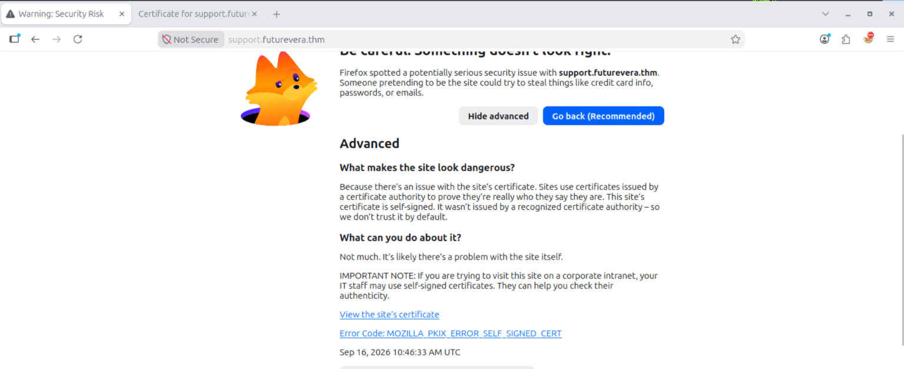
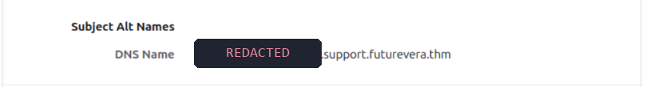
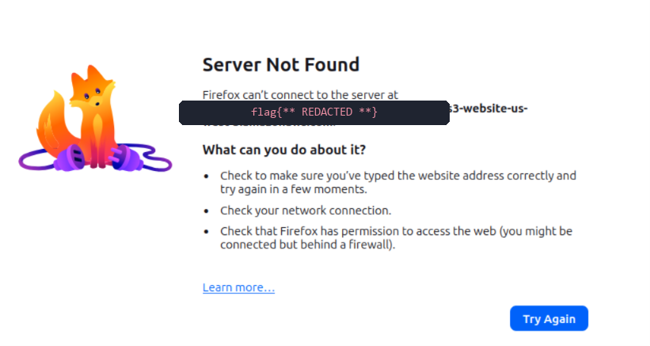

# TryHackMe - Takeover

> Finding a flag hidden in TLS certificates.
> **Category:** Web · Reconnaissance &nbsp;|&nbsp; **Difficulty:** Easy &nbsp;|&nbsp; **Target:** `futurevera.thm`
> &nbsp;|&nbsp; **Room:** [tryhackme.com/room/takeover](https://tryhackme.com/room/takeover)

> [!NOTE]
> **Spoiler-free write-up.** The secret subdomain and the final flag are masked on
> purpose, so you can still solve the room yourself. Follow the method, not the answer.

## Overview

Takeover is a compact but instructive lesson in **passive subdomain discovery**.
The web server barely exposes anything through the usual channels, and the whole
path forward is hidden inside the **TLS certificates** served by the host. By
following the `Subject Alternative Name` (SAN) fields from one certificate to the
next, we pivot across three subdomains until the final one leaks the flag.

**Attack path**

```
futurevera.thm  >  support.futurevera.thm  >  [secret-subdomain].support.futurevera.thm  >  flag
```

## Reconnaissance

### 1. Mapping the target

As the room hint suggests, the first step is to point the target's hostname at
its IP. We add `futurevera.thm` to our `/etc/hosts` file so name resolution
works locally.

```console
root@kali:~# echo "10.10.x.x    futurevera.thm" >> /etc/hosts
root@kali:~# tail -n 1 /etc/hosts
10.10.x.x    futurevera.thm
```

### 2. Port & service scan

With the host resolvable, we run an `nmap` scan with default scripts and version
detection to enumerate the exposed services.

```console
root@kali:~# nmap -sC -sV futurevera.thm

Nmap scan report for futurevera.thm (10.x.x.x)
Host is up (0.00011s latency).
Not shown: 997 closed tcp ports (reset)
PORT    STATE SERVICE  VERSION
22/tcp  open  ssh      OpenSSH 8.2p1 Ubuntu 4ubuntu0.13
80/tcp  open  http     Apache httpd 2.4.41 ((Ubuntu))
443/tcp open  ssl/http Apache httpd 2.4.41
| ssl-cert: Subject: commonName=futurevera.thm
|_http-title: FutureVera
Service Info: OS: Linux; CPE: cpe:/o:linux:linux_kernel
```

Three services are open: **SSH (22)**, **HTTP (80)** and **HTTPS (443)**. Port 80
redirects to HTTPS, and the certificate on 443 already whispers the theme of the
room: this challenge is about **certificates**.

### 3. Web content enumeration

A quick content scan with `gobuster` confirms the front door is a dead end. It
turns up only the expected static folders, with no hidden application logic.

```console
root@kali:~# gobuster dir -u https://futurevera.thm -k \
    -w /usr/share/wordlists/dirb/common.txt -x php,txt,html,bak

/assets               (Status: 301) [--> /assets/]
/css                  (Status: 301) [--> /css/]
/index.html           (Status: 200) [Size: 4605]
/js                   (Status: 301) [--> /js/]
/server-status        (Status: 403) [Size: 280]
Finished
```

Nothing actionable here. Time to look where the room actually points us: the
certificates.

## The certificate trail

### 4. The support subdomain

The challenge description mentions the **support** desk being under maintenance,
so we try the obvious subdomain `support.futurevera.thm`, add it to
`/etc/hosts`, and browse to it. The browser immediately throws a self-signed
certificate warning.



A certificate warning is not an obstacle here, it is the objective. We click
**View the site's certificate** and inspect the `Subject Alternative Names`
section.



> [!IMPORTANT]
> **The SAN reveals a new host:** `[secret-subdomain].support.futurevera.thm`,
> a subdomain that appears nowhere else on the site.

### 5. Confirming it from the command line

The same information is retrievable without a browser. Using `openssl s_client`,
we can dump the certificate a host presents and read its extensions directly, a
handy trick when scripting reconnaissance.

```console
root@kali:~# openssl s_client -connect support.futurevera.thm:443 \
    -servername support.futurevera.thm </dev/null 2>/dev/null \
    | openssl x509 -noout -ext subjectAltName

X509v3 Subject Alternative Name:
    DNS:[secret-subdomain].support.futurevera.thm
```

We add `[secret-subdomain].support.futurevera.thm` to `/etc/hosts` and repeat
the same certificate inspection one final time.

### 6. Capturing the flag

Browsing to the newly discovered host, the certificate and the page it redirects
to point at an Amazon S3 static website bucket. **The bucket name *is* the flag.**




## Key takeaways

- **Certificates are an information leak.** Subject Alternative Name fields
  routinely disclose internal or staging hostnames that never appear anywhere
  else.
- **Always inspect self-signed certificates.** A browser warning is a signal to
  look closer, not to turn back. The interesting data lives in the certificate
  details.
- **`openssl s_client` is your friend.** Piping it into
  `openssl x509 -ext subjectAltName` reveals SANs quickly and scriptably,
  without a browser.
- **Pivot host by host.** Each certificate pointed to the next subdomain.
  Patient enumeration, not exploitation, solved this room.

## License

This write-up is released under the [MIT License](LICENSE).

---

*Thanks for reading! If this helped, drop a ⭐ and follow [**@TomDmn**](https://github.com/TomDmn) for more TryHackMe write-ups.*
